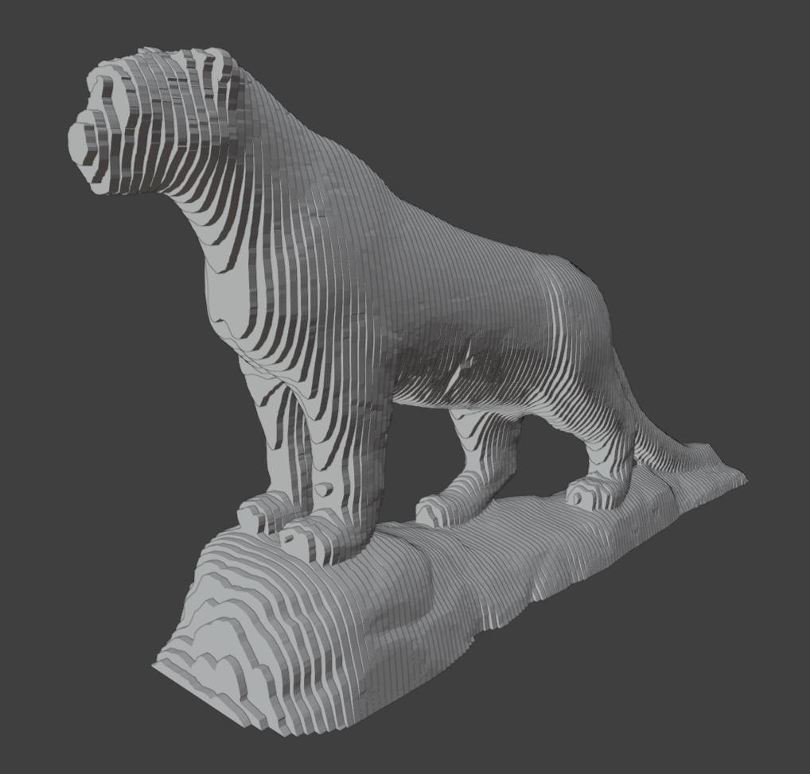
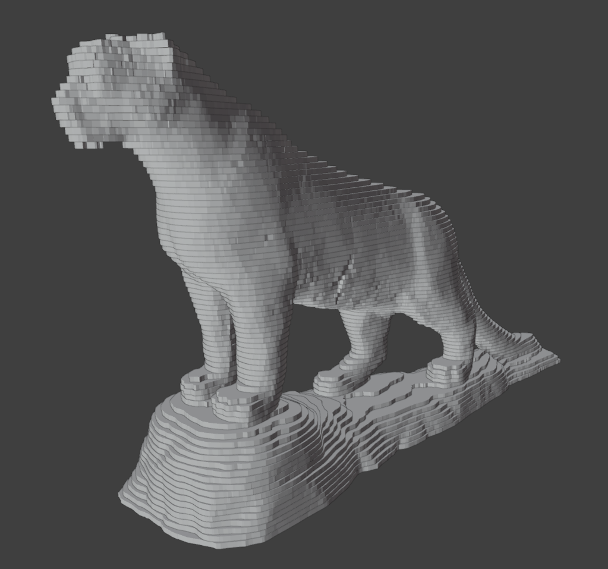

# Blender slicer utility

# What is it

This python script can slice a model into disks of specific width. Disks are slices of the model extended by width. Can be used for creating layers out of models for further use in crafting, DIY or anything else.

You can also create a flat atlas from the set of disks. Instead of an assembled model you will get all disks sorted and put on one plane for references and screenshoting.

# How to use

Copy python script `slicercode.py` to text editor in Blender. The only* line of code you should change is the last one: `split_model_to_disks("Sphere", 0.1, 'Z', False)`. First argument is name of the target object, second is width of a single disk, third is axis and forth is flag whether to create an atlas instead of an assembled model.

*: unless you also want to control atlas settings, they are only set inside the `create_atlas` function

The `Disks` collection must be selected (it will be created automatically on first call) and you must be in Object mode in order for the script to run properly.

Note that all objects in the `Disks` collections are temporary and will be deleted automatically next time the script is run. Each time all objects in this collections are flushed and replaced with new ones.

Running the script on a model **does not** alter the original model in any way.

In order to create an atlas instead of a full model just flag `do_create_atlas` in the `split_model_to_disks` function.

# Details

You can change width of each disk and switch axis.

